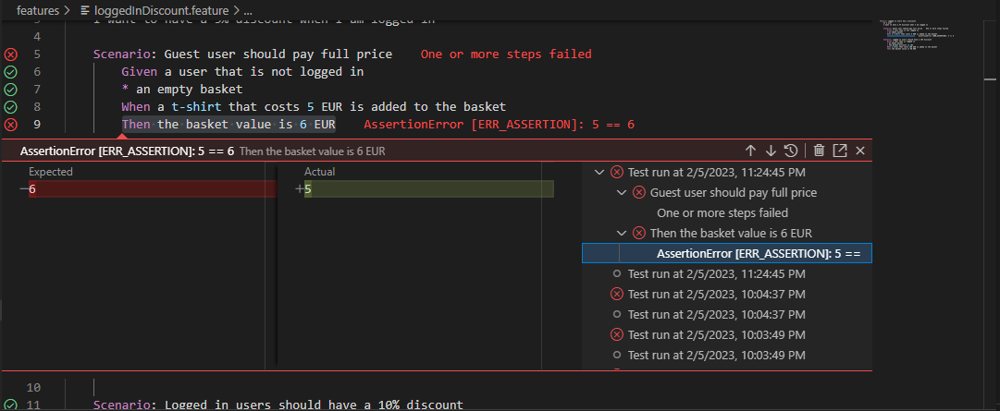

<h1 align="center">
    
    <br>
    CucumberJS Test Runner
</h1>

This extension integrates CucumberJS with Visual Studio Code Test Runner.

# Features

Semlessly integrates with Visual Studio Code new Test Runner showing all files in your workspace and a detailed view of all:

-   Features
-   Scenarios
-   Steps


## Test Result in `.feature` files

---

Now you can view which steps passed or failed directly in your `.feature` files, and with the help of the official Cucumber extension you can `ctrl+click` to navigate to your failing step.


## Inline error details

---

After running the test you will see an inline report of the failing tests with extensive details of the error and an history of test results.



## Debug an entire feature or a single scenario

---

You can even debug your tests directly from the Test Runner UI, just click the `Debug Test` action on a Feature or a Scenario!


## New in version 0.5.0

---

We support searching and filtering tests by @Tag (Thanks to psethwick)


Now you can specify environment variables in your `settings.json` file, so that when you run your tests those variables will be defined.

```json
{
    "cucumberTestRunner.env": {
        "MY_VARIABLE_1": "foo",
        "MY_VARIABLE_2": "bar"
    }
}
```

# Prerequisites

You need to have a working `cucumber-js` installation in your working folder and a proper cucumber configuration file.
Please follow the documentation on the official `cucumber-js` website on how to setup the environment.

You need to install the `@cucumber/cucumber` npm package

```bash
npm install @cucumber/cucumber
```

For typescript support you need to install `ts-node`

```bash
npm install ts-node
```

# Compatibility

The extension has been tested with `javascript` and `typescript`.

Example of a `cucumber.yml` file for a `typescript` setup:

```yaml
default:
    features: ["features/**/*.feature"]
    requireModule: ["ts-node/register"]
    require: ["features/**/*.{js,ts}"]
    publishQuiet: true
```

# Known Issues

If you're using a `cucumber.js` file instead of `cucumber.yaml`, please define a profile named `default` that has all your configuration except the `paths` option.
There is currently an issue with how `cucumber-cli` handles command line arguments.

User the non-default profile to run your tests from the command line and the default profile will be used by the extension.
In the future the extension will allow you to choose which profile to use to launch tests.

Here is an example of a viable `cucumber.js` file:

```javascript
const common = {
    require: ["features/**/*.{js,ts}"],
    requireModule: ["ts-node/register"],
    publishQuiet: true,
};

module.exports = {
    default: {
        ...common,
    },
    cli: {
        ...common,
        paths: ["features/**/*.feature"],
    },
};
```
